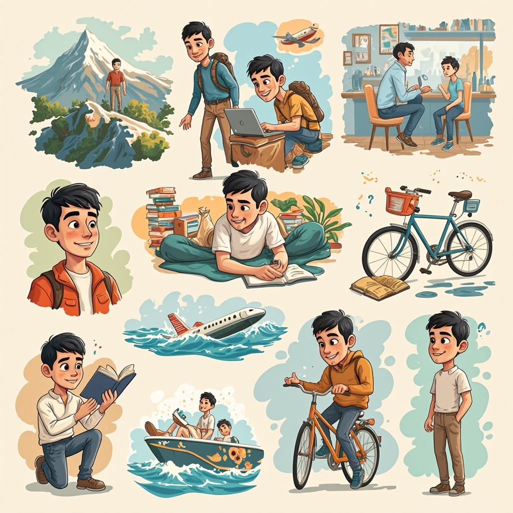
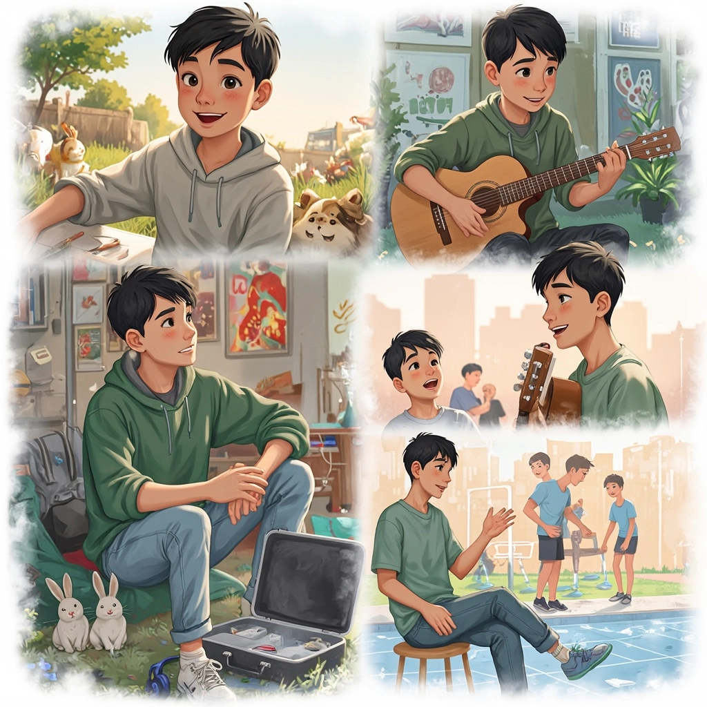

# Simple Uzbek Past Tense Lesson
## O'zbek tilida o'tgan zamon (I have done / I did)

### What will you learn today?
- How to say "I have done" something in Uzbek
- How to talk about your past experiences
- How to ask questions about the past

---

## How to make this tense / Qanday yasaladi

Add these endings to any verb:

| Who? | Ending | Example |
|------|--------|---------|
| I (men) | **-ganman** | **borgan**man (I have gone) |
| You (sen) | **-gansan** | **borgan**san (you have gone) |
| He/She (u) | **-gan** | **borgan** (he/she has gone) |

### Easy examples:
- **yemoq** (to eat) → **yeganman** (I have eaten)
- **ko'rmoq** (to see) → **ko'rganman** (I have seen)  
- **bormoq** (to go) → **borganman** (I have gone)
- **o'qimoq** (to read) → **o'qiganman** (I have read)

---

## Vocabulary / So'z boyligi

- **hayot kechirmoq** - to live life
- **sayohat qilmoq** - to travel
- **tog'ga chiqmoq** - to climb mountains
- **ot minmoq** - to ride a horse
- **velosipedda yurib ko'rmoq** - to ride a bicycle
- **teatrda spektakl ko'rmoq** - to watch theater performance
- **mashhur** - famous
- **samolyotdan sakramoq** - to jump from a plane
- **parachutdan sakramoq** - to jump with parachute
- **marafonda yugurmoq** - to run in marathon
- **gitara chalmoq** - to play guitar
- **pianino chalmoq** - to play piano
- **konsertda ijro etmoq** - to perform at concert
- **computer o'yinlarini o'ynamoq** - to play computer games
- **pul tikib o'ynamoq** - to gamble
- **suzishni o'rganmoq** - to learn swimming
- **kaltakesak** - lizard
- **tatib ko'rmoq** - to taste/try
- **turli** - various/different
- **davomida** - during
- **yutuq** - achievement
- **maqtanmoq** - to be proud/to brag

---

## Activity 1: Countries and cities / Mamlakatlar va shaharlar
### Simple warm-up (5 minutes)

Practice with your teacher using these simple examples:

**Examples:**
- **Men Fransiyaga borganman.** (I've been to France.)
- **Qaysi shaharga borganingiz?** (Which city have you been to?)
- **Men Parijga borganman.** (I've been to Paris.)
- **Men hech qachon Turkiyaga borganmasman.** (I've never been to Turkey.)

#### Try with these countries and cities:

| Country / Mamlakat | City / Shahar |
|-------------------|---------------|
| **Rossiya** | Moskva, Sankt-Peterburg |
| **Turkiya** | Istanbul, Anqara |
| **Fransiya** | Parij, Lion |
| **Germaniya** | Berlin, Myunxen |
| **Amerika** | Nyu-York, Los-Anjeles |
| **Yaponiya** | Tokyo, Osaka |

**Teacher asks:** Sen qaysi mamlakatga borgansan?
**Student answers:** Men... ga borganman / Men hech qachon... ga borganmasman.

---

## Activity 2: Meet Sardor! / Sardor bilan tanishing
### Reading and discovering (8 minutes)

Read about Sardor and his life experiences. Pay attention to the words ending in **-gan**.

**Sardor's Story:**

*Sardor 25 yoshda. U juda qiziq hayot kechirgan. U bir marta Amerika mamlakatiga borgan. U yerda uch oy yashagan va ingliz tilini yaxshi o'rgangan. Sardor ikki marta tog'ga chiqgan. U birinchi marta 18 yoshida, ikkinchi marta o'tgan yili chiqgan. U ko'p kitoblar o'qigan - jami 50 ta kitob! U hech qachon ot minmagan, lekin u velosipedda ko'p yurib ko'rgan. Sardor bir marta mashhur aktyorni ko'rgan - bu Bobur Yuldashev edi. U teatrda uch marta spektakl ko'rgan. U hech qachon samolyotdan sakramagan, chunki u qo'rqadi. Lekin u dengizda suzishni o'rgangan va endi juda yaxshi suzadi.*

#### Now tell your teacher about Sardor using these hints:

1. Amerika mamlakatiga bormoq
2. Amerika mamlakatida yashmoq
3. ingliz tilini o'rganmoq  
4. tog'ga chiqmoq
5. kitob o'qimoq
6. ot minmoq
7. velosipedda yurib ko'rmoq
8. mashhur odamni ko'rmoq
9. teatrda spektakl ko'rmoq
10. samolyotdan sakramoq
11. dengizda suzishni o'rganmoq

---

## Alternative texts for practice / Mashq uchun boshqa matnlar

### Meet Gulnora! / Gulnora bilan tanishing

*Gulnora 30 yoshda va u jurnalist. U juda ko'p sayohat qilgan. U to'rt marta Evropaga borgan - Fransiya, Italiya, Germaniya va Ispaniyaga. U hech qachon Amerikaga bormagan, lekin u Yaponiyaga bir marta borgan. Gulnora uch ta til biladi: o'zbek, rus va ingliz tillarini o'rgangan. U hech qachon arabcha o'rganmagan. U ko'p mashhur odamlar bilan suhbatlashgan - prezidentlar, aktyor va sportchilar bilan. U ikki marta parachutdan sakragan! U sport qilishni yaxshi ko'radi va marafonlarda ikki marta yugurgan. Gulnora hech qachon cho'chqa go'shti yemagan, chunki u musulmon. Lekin u turli milliy taomlarni tatib ko'rgan - yapon, fransuz va italyan taomlarini. U kitob yozgan - "Mening sayohatlarim" nomli.*

#### Tell your teacher about Gulnora using these hints:
1. Evropaga bormoq
2. Amerikaga bormoq  
3. Yaponiyaga bormoq
4. til o'rganmoq
5. arabcha o'rganmoq
6. mashhur odamlar bilan suhbatlashmoq
7. parachutdan sakramoq
8. marafonda yugurmoq
9. cho'chqa go'shti yemoq
10. turli milliy taomlarni tatib ko'rmoq
11. kitob yozmoq

---

### Meet Rustam! / Rustam bilan tanishing

*Rustam 19 yoshda va u talaba. U juda qiziq yoshlik o'tkazgan. U bolakligida ko'p hayvonlar bilan o'ynagan. U it, mushuk va quyonlarni boqgan. U hech qachon ilon yoki kaltakesak ko'rmagan. Rustam musiqa o'rganishni yaxshi ko'radi. U gitara chalishni o'rgangan va uch yil davomida o'rgangan. U hech qachon pianino chalishni o'rganmagan. U ko'p konsertlarga borgan - rok, jazz va klassik musiqa konsertlariga. U bir marta o'zi konsertda ijro etgan! Rustam computer o'yinlarini yaxshi ko'radi va turli o'yinlarni o'ynagan. U hech qachon pul tikib o'ynagan emas. U sport bilan shug'ullangan - futbol va basketbol o'ynagan. U hech qachon suzishni o'rganmagan, chunki suvdan qo'rqadi.*

#### Tell your teacher about Rustam using these hints:
1. hayvonlar bilan o'ynamoq
2. it, mushuk, quyon boqmoq
3. ilon yoki kaltakesak ko'rmoq
4. gitara chalishni o'rganmoq
5. pianino chalishni o'rganmoq
6. konsertlarga bormoq
7. konsertda ijro etmoq
8. computer o'yinlarini o'ynamoq
9. pul tikib o'ynamoq
10. futbol va basketbol o'ynamoq
11. suzishni o'rganmoq

---

## Activity 3: True or False game / To'g'ri yoki noto'g'ri o'yin
### Fun practice (7 minutes)

Tell your teacher 3 sentences about yourself. 2 are TRUE, 1 is FALSE. Teacher guesses which is false!

**Examples:**
- Men 5 ta kitob o'qiganman. (I have read 5 books.)
- Men fil ko'rganman. (I have seen an elephant.)
- Men samolyotda uchganman. (I have flown in a plane.)

#### Your 3 sentences:
1. ________________________________________
2. ________________________________________  
3. ________________________________________

---

## Activity 4: Problem solving / Muammo yechish
### Tell about a problem you solved (8 minutes)

Think of a simple problem you had and how you solved it.

**Easy pattern:**
1. **Men... muammo bor edi.** (I had a... problem)
2. **Men... qilganman.** (I did...)
3. **Keyin yaxshi bo'lgan.** (Then it became good)

**Example:**
- Men til muammo bor edi. (I had a language problem)
- Men har kuni o'qiganman. (I studied every day)  
- Keyin yaxshi bo'lgan. (Then it became good)

#### Common problems:
- til muammo (language problem)
- ish muammo (work problem)
- sog'liq muammo (health problem)
- pul muammo (money problem)

---

## Activity 5: Show off! / Maqtanish vaqti
### Tell about your achievements (5 minutes)

Tell your teacher something you are proud of! Be confident!

**Examples:**
- **Men uchta til bilaman va inglizni o'rganganman!** (I know three languages and learned English!)
- **Men sport qilganman!** (I have done sports!)
- **Men yaxshi oshpaz bo'lganman!** (I have become a good cook!)

#### Your achievement:
Men ________________________________________________!

---

## Activity 6: Future dreams / Kelajak orzular  
### What will you do? (7 minutes)

Talk about what you want to do in the future. Imagine you already did it!

**Pattern:** Kelajakda men... ganman bo'ladi. (In the future, I will have...)

**Examples:**
- Kelajakda men yangi ish topganman bo'ladi. (I will have found a new job)
- Kelajakda men o'zbek tilini o'rganganman bo'ladi. (I will have learned Uzbek)

#### Your dreams:
1. Kelajakda men _________________________ bo'ladi.
2. Kelajakda men _________________________ bo'ladi.
3. Kelajakda men _________________________ bo'ladi.

---

## Activity 7: Mini interview / Kichik intervyu
### Practice for real life (10 minutes)

Teacher is asking about your experience. Answer using the past tense.

**Teacher asks:**
1. **Siz ishlaganmisiz?** (Have you worked?)
2. **Qanday ish qilganingiz?** (What kind of work have you done?)
3. **O'zbekcha o'rganganingiz qancha vaqt?** (How long have you studied Uzbek?)
4. **Eng yaxshi ko'rgan ishingiz nima?** (What's your favorite activity?)

---

## Homework / Uy vazifasi

### Easy writing task:
Write 5 sentences about your week using the past tense.

**Example:**
- Men dushanba kuni ishga borqanman.
- Men kitob o'qiganman.
- Men do'stim bilan gaplashganman.

### Speaking practice:
Tell someone in your family about what you learned today!

---

## Check yourself / O'zingizni tekshiring

How do you feel about these things? (1 = hard, 5 = easy)

| What can you do? | How easy? |
|------------------|-----------|
| Make past tense with -ganman | ___/5 |
| Ask "Have you ever...?" questions | ___/5 |
| Talk about your experiences | ___/5 |
| Understand when teacher uses past tense | ___/5 |

### Think about:
1. What was easy today?
2. What was hard?
3. What do you want to practice more?

---

## Extra practice ideas / Qo'shimcha mashq

### At home:
- Look at old photos and say what you have done
- Tell your family about your day using past tense
- Watch simple Uzbek videos and listen for -gan words

### Next lesson:
- We will practice more past tense
- You will tell longer stories about your life
- We will learn new verbs

---

*Teacher tips: Keep it simple and encouraging. Let student make mistakes - focus on communication first, then correct gently. Use gestures and pictures to help with new words. Practice the same patterns many times in different ways.* 